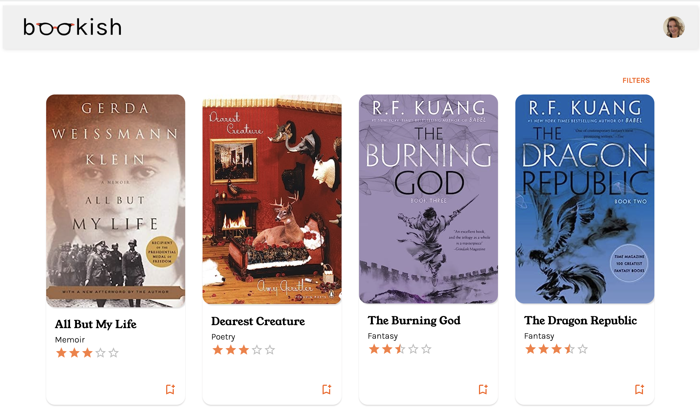

# bookish 📚 

## User Stories 
As a user, you will be able to: 
* Manage your account (sign up, login, login with Google, edit your profile, delete account)
* View other user profiles
* View a collection of books
* Filter and sort books by average rating
* View an individual book with additional detail, such as quotes, recommendations, and reviews 
* Create your own book shelves
* Add books to default or custom shelves
* Remove books from shelves or delete shelves 

## References and Acknowledgements
[Sinziana Susa: open book photo](https://unsplash.com/photos/SNHsMunOPME)  
[Debby Hudson: blank book photo](https://unsplash.com/photos/o9KNLaITFYw)  
 
Book descriptions and photos: 
* [Dearest Creature](https://www.amazon.com/Dearest-Creature-Penguin-Poets-Gerstler/dp/0143116355)
* [The Poppy War](https://www.amazon.com/Poppy-War-Novel-R-Kuang/dp/0062662589/ref=sr_1_1?crid=1C93ZL6EPINEL&keywords=the+poppy+war&qid=1689101427&s=books&sprefix=the+poppy+wa%2Cstripbooks%2C160&sr=1-1)
* [The Dragon Republic](https://www.amazon.com/Dragon-Republic-Poppy-War/dp/0062662600/ref=d_bmx_dp_bh1j8wen_sccl_2_1/141-6600875-1678045?pd_rd_w=uPrhf&content-id=amzn1.sym.89512a7c-a919-49e3-b2b6-29bdaca4f3b5&pf_rd_p=89512a7c-a919-49e3-b2b6-29bdaca4f3b5&pf_rd_r=R36QPPFTGF9NVK3PNC79&pd_rd_wg=vlg0v&pd_rd_r=25ce3365-eaea-4903-b6ed-f293e1f456fd&pd_rd_i=0062662600&psc=1)
* [The Burning God](https://www.amazon.com/Burning-God-Poppy-War/dp/0062662643/ref=pd_bxgy_img_sccl_1/141-6600875-1678045?pd_rd_w=CnFqq&content-id=amzn1.sym.26a5c67f-1a30-486b-bb90-b523ad38d5a0&pf_rd_p=26a5c67f-1a30-486b-bb90-b523ad38d5a0&pf_rd_r=GETZ072SV7TN24RYGA1G&pd_rd_wg=28ScX&pd_rd_r=9654b2a6-1ee9-4adc-a7df-f335b47bd838&pd_rd_i=0062662643&psc=1)
* [The Overstory](https://www.amazon.com/Overstory-Novel-Richard-Powers/dp/039335668X/ref=d_zg-te-pba_sccl_2_1/141-6600875-1678045?pd_rd_w=f6Pvl&content-id=amzn1.sym.081392b0-c07f-4fc2-8965-84d15d431f0d&pf_rd_p=081392b0-c07f-4fc2-8965-84d15d431f0d&pf_rd_r=K2XQEETYZ3ZKYF0JHEC0&pd_rd_wg=6unP0&pd_rd_r=fafc1baf-9d67-4c88-92cd-8872e67d65e5&pd_rd_i=039335668X&psc=1)
* [Who's Afraid of Virginia Woolf?](https://www.amazon.com/Whos-Afraid-Virginia-Woolf-Revised/dp/0451218590/ref=pd_bxgy_img_sccl_1/141-6600875-1678045?pd_rd_w=jnssG&content-id=amzn1.sym.26a5c67f-1a30-486b-bb90-b523ad38d5a0&pf_rd_p=26a5c67f-1a30-486b-bb90-b523ad38d5a0&pf_rd_r=KP94W6T15M4JPGEBZ2A3&pd_rd_wg=ESmt3&pd_rd_r=6d3aec6c-53d5-4e52-9a1c-03d70dca9b6d&pd_rd_i=0451218590&psc=1)
* [Where the Wild Things Are: Description](https://www.amazon.com/Where-Wild-Things-Maurice-Sendak/dp/0060254920/ref=tmm_hrd_swatch_0?_encoding=UTF8&qid=1689101793&sr=1-4)
* [Where the Wild Things Are: Photo](https://www.amazon.com/Where-Wild-Things-Are-Notebook/dp/B09ZQFSJLV/ref=d_pd_sbs_sccl_1_2/141-6600875-1678045?pd_rd_w=pweoL&content-id=amzn1.sym.1e7a0ba4-f11f-4432-b7d8-1aaa3945be18&pf_rd_p=1e7a0ba4-f11f-4432-b7d8-1aaa3945be18&pf_rd_r=WCD337JPSHPPWJ8HNHTG&pd_rd_wg=IcY1v&pd_rd_r=0a26455d-dd48-4ead-9f8a-032a8a5da457&pd_rd_i=B09ZQFSJLV&psc=1)
* [The Interestings](https://www.amazon.com/Interestings-Novel-Meg-Wolitzer/dp/1594632340/ref=sr_1_1?crid=1QTCVSC576813&keywords=the+interestings&qid=1689101923&s=books&sprefix=the+interestings+%2Cstripbooks%2C132&sr=1-1)
* [All But My Life](https://www.amazon.com/All-But-My-Life-Memoir/dp/0809015803/ref=sr_1_1?crid=AEXAKY7U95FR&keywords=all+but+my+life+by+gerda+weissmann+klein&qid=1689891640&sprefix=all+but+my+life%2Caps%2C132&sr=8-1)
